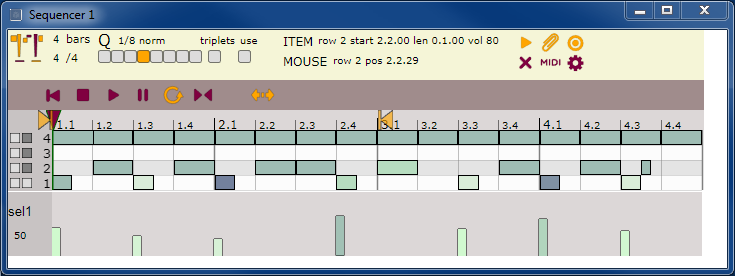
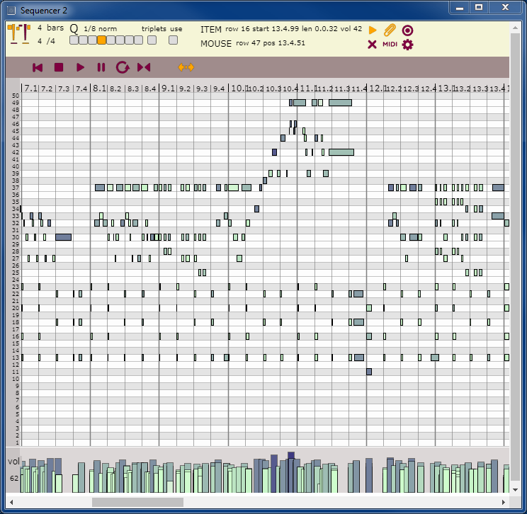
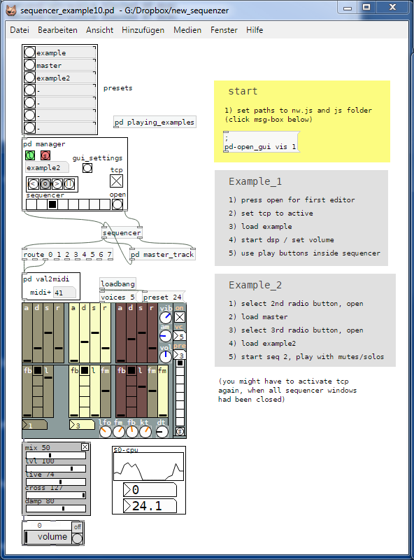

# Sequencer and (Midi) Editor

### Sequencer and midi-style editor for pure data / Purr Data. 

Uses nw.js for the editor. It's preferable to use the sdk version to see the commands exchanged between pd and nw.
Console can be opened by F12. nw.js can be downloaded from here:

https://nwjs.io/

Open sequencers_example.pd and follow the instructions. 

### Shortcuts and Controls

For a description and a list of available shortcuts click on the faces in the upper left corner of the editor.

- ITEMS
	- created and deleted by clicking and drawing
	- can be moved and resized by dragging
- SELECTIONS
	- selections of a row or by dragging
	- selections can be extended or deleted
	- selections can be moved on x an y-axis
- SNAPSHOTS
	- up to 10 snapshots can be taken and recalled
- TRANSPORT
	- possibility of defining an inner loop region
- PARAMETERS
	- custom parameters with custom settings (start, scope, step)
- SOLO/MUTE
	- usefull for replay and editing
- MIDI
	- imports midi files of type 1

Works with pd vanilla and Purr Data, tested on win7/win10.

pd vanilla needs following libraries: zexy, moocow, mrpeach and hcs. moonlib is needed for the synth in the example.

The handling of the editor is done with pd. The editor might be controlled by any other program using tcp ports 8150 (server) / 8151 (client) for communication.
 

The code of the midi import filter was taken from:

https://github.com/gasman/jasmid and https://github.com/NHQ/midi-file-parser

Thanks to the authors!
