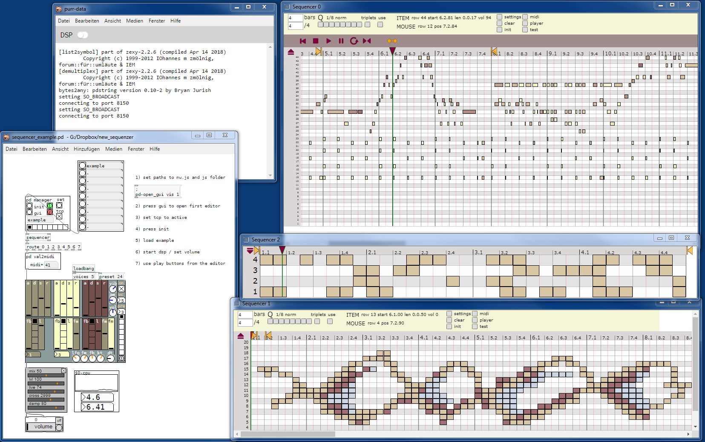

# Sequencer and (Midi) Editor

Uses nw.js for the editor. It's preferable to use the sdk version to see the commands exchanged between pd and nw.
Console can be opened by F12. nw.js can be downloaded from here:

https://nwjs.io/

Open sequencers_example.pd and follow the instructions. 
More information will be added soon.

## Shortcuts and Controls
- ITEMS
	- ctrl + click / doubleclick: set item
	- mmb on item: delete item
	- ctrl + wheel on item: set volume
	- shift + ctrl + mousemove: draw mode
	- alt + shift + mousemove: erase mode
	- ctrl + wheel: scale x-axis
	- shift + wheel: scroll x-axis
- PLAYER
	- space: starts/stops playing
	- click into x-scale sets transport start
	- ctrl click into x-scale sets loop-region start
	- alt click into x-scale sets loop-region end
	- loop-regions are draggable

Works with Purr Data, tested on win7/win10, will work with pd vanilla soon.
 

The code of the midi import filter was taken from:

https://github.com/gasman/jasmid and https://github.com/NHQ/midi-file-parser

Thanks to the authors!
