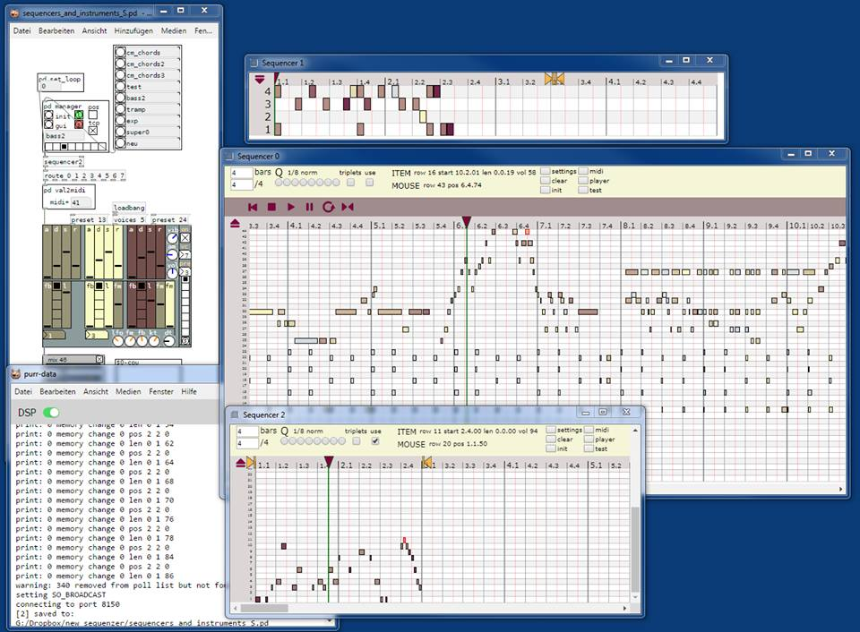

# Sequencer and (Midi) Editor

Uses nw.js for the editor. nw can be downloaded from here:

https://nwjs.io/

It's preferable to use the sdk version to see the commands exchanged between pd and nw.
Console can be opened by F12.

Open sequencers_example.pd and follow the instructions. More information will be added soon.

Works with Purr Data, tested on win7/win10, will work with pd vanilla soon.

space: starts/stops playing

ctrl + click / doubleclick: set item

mmb on item: delete item

ctrl + wheel on item: set volume

shift + ctrl + mousemove: draw mode

alt + shift + mousemove: erase mode

ctrl + wheel: scale x-axis

shift + wheel: scroll x-axis
 

